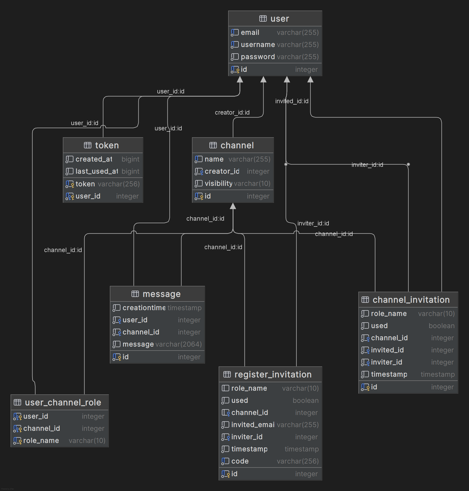

# Backend Documentation

> This is the backend documentation for the TalkRooms project.

## Table of Contents
* [Introduction](#introduction)
* [Data Model](#data-model)

---

## Introduction
The backend server is an API that provides the functionality for the ChImp app.
It is written in Kotlin in a JVM gradle project.

The JVM application is a simple Spring Boot application, built with Spring Initializer. Some used dependencies are:

* **Spring Web** - for the REST API;
* **JDBI** - for the database access, using PostgresSQL.
* **Bearer Token** - for the authentication.

## Data Model

- `user` : Contains user information: id, username, email, password.
- `channel` : Contains channel information: id, name, visibility.
- `message` : Contains message information: id, message, creationTime.
- `token` : Contains token information: token, created_at, last_used_at.
- `registerInvitation` : Contains register invitation information: id, email, role, used, creationTime.
- `channelInvitation` : Contains channel invitation information: id, role, used, creationTime.
- `user_channel_role` : Contains user role in a channel information: user_id, channel_id, role.

## Spring Diagrams
### Beans Dependency Diagram

### Context Dependencies Diagram
